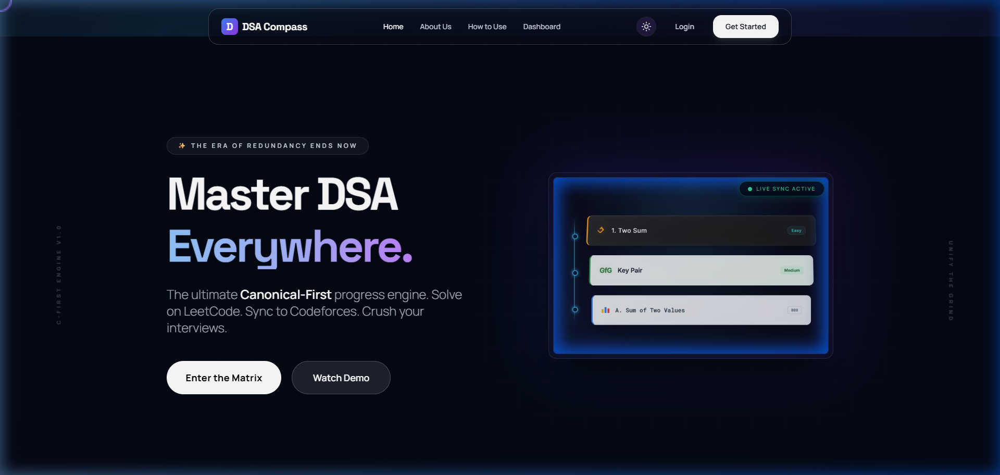
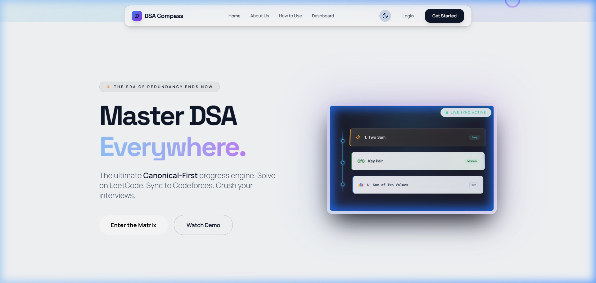
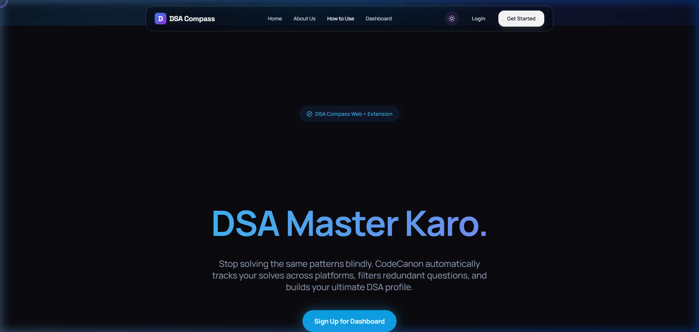
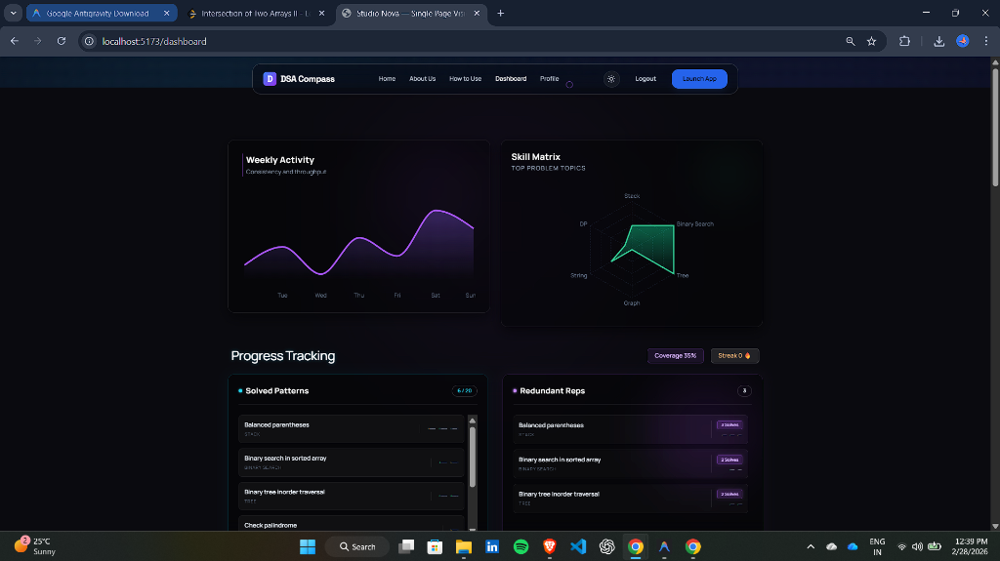
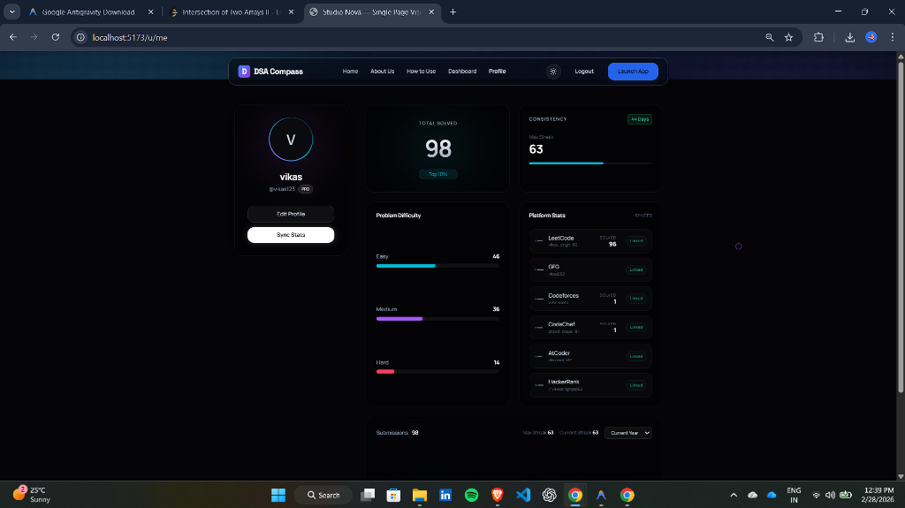
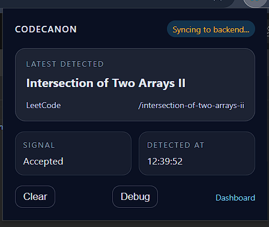
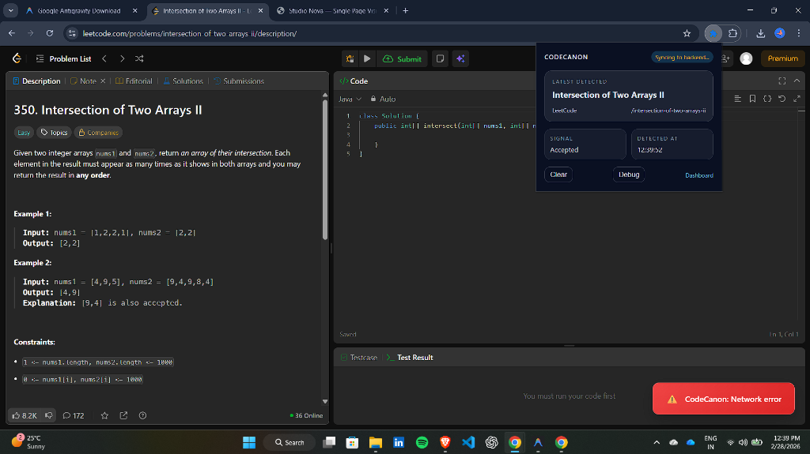

<h1 align="center">
  
</h1>

<p align="center">
  <b>Stop solving the same problems blindly. Track every solve, kill redundancy, master DSA.</b>
</p>

<p align="center">
  
  
  
  
  
</p>

---

## 📸 Screenshots Light and Dark mode

### 🌙 Landing Page (Dark Mode)


### ☀️ Landing Page (Light Mode)


### 🗺️ How It Works Page


### 📊 Dashboard


### 👤 Profile Page


### 🔌 Chrome Extension in Action




---

## ✨ Features

- 🔌 **Auto-Sync** — Chrome extension silently captures every accepted solve in real time
- 🗺️ **Canonical Mapping** — Problems across platforms are grouped under a single canonical entry, eliminating duplicates
- 📊 **Activity Heatmap** — GitHub-style contribution graph showing your daily solving activity
- 🕸️ **Topic Radar** — Radar chart showing mastery across DSA topics
- 🔁 **Redundancy Tracker** — See exactly which problems you've re-solved across platforms
- 🏅 **Streak Tracking** — Daily streak counter to keep you motivated
- 🔐 **Auth** — Email/password + Google OAuth login
- 👤 **Public Profile** — Shareable profile URL to showcase your solve history
- ✅ **Manual Mark** — Manually mark a problem as solved offline

### Supported Platforms
| Platform | Auto-Detect |
|----------|:-----------:|
| LeetCode | ✅ |
| GeeksForGeeks (GFG) | ✅ |
| Codeforces | ✅ |
| HackerRank | ✅ |
| CodeChef | ✅ |
| AtCoder | ✅ |
| SPOJ | ✅ |

---

## 🔧 How It Works

### Step 1 — Install the Chrome Extension

```
1. Clone this repo
2. Open Chrome → chrome://extensions
3. Enable "Developer Mode" (top right toggle)
4. Click "Load Unpacked" → select the /extension folder
```

The extension registers content scripts on all 7 platforms. It watches the DOM for an **"Accepted" / "Correct Answer"** verdict in real time.

### Step 2 — Sign Up & Enter Your Platform Handles

When you sign up on the web app, enter your usernames for each coding platform (LeetCode handle, Codeforces handle, etc.). This lets the server correctly attribute a solve to your account.

### Step 3 — Solve Problems Normally

Just code as you always do. When you get an **Accepted** verdict on any supported platform, the extension:

1. Detects the verdict via DOM observation
2. Reads the problem title/slug from the page
3. POSTs to `http://localhost:5000/api/solve` with your platform + problem info
4. The server maps it to a **canonical question** (deduplication)
5. Your dashboard updates instantly 🎉

### Step 4 — View Your Dashboard

Log in to the web app at `http://localhost:5173`. You'll see:

- **Activity Graph** — Daily solving activity heatmap
- **Topic Radar** — Which DSA categories you're strongest in
- **Solved Patterns** — All unique canonical problems you've cracked
- **Redundant Reps** — Problems you've solved on 2+ platforms
- **Canonical Library** — Full question bank with your solve status per platform

---

## 🚀 Local Setup

### Prerequisites
- Node.js >= 18
- MongoDB (local or Atlas URI)
- A Google OAuth app (optional, for Google login)

### 1. Clone the repository

```bash
git clone https://github.com/vikas062/Dsa-Compass.git
cd Dsa-Compass
```

### 2. Install dependencies

```bash
# Frontend
npm install

# Backend
cd server && npm install
```

### 3. Configure environment variables

Create `server/.env` based on `server/.env.example`:

```env
MONGO_URI=mongodb://localhost:27017/dsa-compass
JWT_SECRET=your_super_secret_key
GOOGLE_CLIENT_ID=your_google_client_id
GOOGLE_CLIENT_SECRET=your_google_client_secret
SESSION_SECRET=your_session_secret
CLIENT_URL=http://localhost:5173
PORT=5000
```

### 4. Seed canonical questions

```bash
cd server && npm run seed
```

### 5. Start both servers

```bash
# Terminal 1 — Backend
cd server && npm run dev

# Terminal 2 — Frontend
npm run dev
```

- 🌐 Frontend: `http://localhost:5173`
- 🔌 Backend API: `http://localhost:5000`

### 6. Load the Extension

```
chrome://extensions → Enable Developer Mode → Load Unpacked → select /extension folder
```

---

## 🧩 Project Structure

```
Dsa-Compass/
├── extension/           # Chrome MV3 content scripts
│   ├── leetcode.js      # LeetCode solve detector
│   ├── gfg.js           # GFG solve detector
│   ├── codeforces.js    # Codeforces solve detector
│   ├── codechef.js      # CodeChef solve detector
│   ├── hackerrank.js    # HackerRank solve detector
│   ├── atcoder.js       # AtCoder solve detector
│   ├── spoj.js          # SPOJ solve detector
│   ├── background.js    # Service worker
│   └── manifest.json    # MV3 config
│
├── server/              # Express + MongoDB API
│   └── src/
│       ├── routes/      # auth, solve, questions, users
│       ├── models/      # User, Question, Solve schemas
│       └── utils/       # Auth middleware, seeder
│
└── src/                 # React (Vite) frontend
    ├── pages/           # Landing, Dashboard, Profile, Login, Signup
    └── components/      # ActivityGraph, TopicRadar, PlatformLogo, UI kit
```

---

## 📡 API Reference

| Method | Endpoint | Auth | Description |
|--------|----------|:----:|-------------|
| `POST` | `/api/auth/signup` | ❌ | Register new user |
| `POST` | `/api/auth/login` | ❌ | Login, returns JWT |
| `GET` | `/api/auth/google` | ❌ | Google OAuth redirect |
| `GET` | `/api/questions` | ❌ | Get all canonical questions |
| `GET` | `/api/questions/with-solves` | ✅ | Questions + your solve status |
| `POST` | `/api/solve` | ❌ | Extension posts a new solve |
| `POST` | `/api/solve/manual` | ✅ | Manually mark a solve |
| `GET` | `/api/users/me` | ✅ | Get current user profile |
| `GET` | `/api/users/:username` | ❌ | Public profile by username |

---

## 🤝 Contributing

Pull requests are welcome! For major changes, please open an issue first.

```bash
git checkout -b feature/your-feature-name
git commit -m "feat: add your feature"
git push origin feature/your-feature-name
```

---

## 📄 License

MIT © [vikas062](https://github.com/vikas062)
